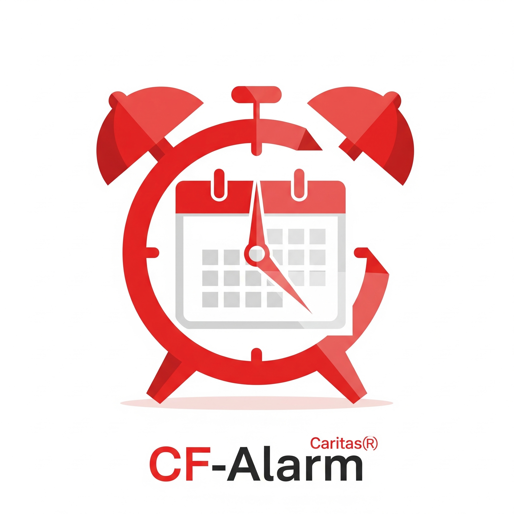

# CF Alarm for Time Office

<div align="center">
  
  
  [](https://android.com)
  [](https://kotlinlang.org)
  [](LICENSE)
  [](https://github.com/f1rlefanz/cf-alarmfortimeoffice)
</div>

## 📱 Über die App

**CF Alarm for Time Office** ist eine intelligente Wecker-App, die automatisch Alarme basierend auf deinen Kalenderterminen setzt. Perfekt für Schichtarbeiter und alle, die ihre Weckzeiten an ihren Arbeitskalender anpassen möchten.

### 🌟 Hauptfunktionen

- 📅 **Automatische Kalendersynchronisation** - Verbindet sich mit Google Calendar
- ⏰ **Intelligente Alarmplanung** - Setzt Alarme basierend auf Arbeitsterminen
- 💡 **Philips Hue Integration** - Wacht mit smartem Licht auf
- 🔄 **Schichtmuster-Erkennung** - Unterstützt wiederkehrende Schichtpläne
- 🔐 **Sicher & Privat** - Alle Daten bleiben lokal auf deinem Gerät
- 🌙 **Sanftes Aufwachen** - Optionale Licht-Simulation vor dem Alarm

## 🚀 Installation

### Voraussetzungen

- Android 5.0 (API Level 26) oder höher
- Google-Konto für Kalenderzugriff
- (Optional) Philips Hue Bridge für Lichtsteuerung

### Google Play Store

*Coming Soon - Die App wird demnächst im Play Store verfügbar sein*

### APK Installation

1. Lade die neueste APK von den [Releases](https://github.com/f1rlefanz/cf-alarmfortimeoffice/releases) herunter
2. Aktiviere "Unbekannte Quellen" in den Android-Einstellungen
3. Installiere die APK-Datei

## 🔧 Einrichtung

### Schritt 1: Google Calendar Verbindung

1. Öffne die App und tippe auf "Mit Google anmelden"
2. Wähle dein Google-Konto aus
3. Erteile die Berechtigung für Kalenderzugriff
4. Wähle den gewünschten Kalender aus

### Schritt 2: Alarm-Konfiguration

1. Navigiere zu "Einstellungen"
2. Stelle die Vorlaufzeit ein (wie viele Minuten vor dem Termin)
3. Wähle Alarmton und Lautstärke
4. Aktiviere optionale Features (Vibration, Licht)

### Schritt 3: (Optional) Philips Hue Setup

1. Stelle sicher, dass die Hue Bridge im gleichen Netzwerk ist
2. Tippe auf "Hue Bridge suchen"
3. Drücke den Link-Button auf der Bridge
4. Wähle die gewünschten Lampen aus

## 📖 Verwendung

### Automatische Alarme

Die App scannt automatisch deinen Kalender und setzt Alarme für:
- Termine mit bestimmten Keywords (z.B. "Arbeit", "Schicht")
- Ganztägige Ereignisse mit Arbeitszeiten
- Wiederkehrende Schichtmuster

### Manuelle Alarme

Du kannst auch manuell Alarme hinzufügen:
1. Tippe auf das "+" Symbol
2. Wähle Zeit und Datum
3. Stelle Wiederholungen ein (optional)
4. Speichere den Alarm

### Smart Wake Features

- **Sunrise Simulation**: Lampen werden 30 Minuten vor dem Alarm langsam heller
- **Snooze mit Licht**: Beim Snoozen dimmt das Licht automatisch
- **Wetter-Integration**: Passt Lichtfarbe an Wetterbedingungen an

## 🛡️ Datenschutz & Sicherheit

- **Lokale Datenspeicherung**: Alle Daten bleiben auf deinem Gerät
- **Verschlüsselte Tokens**: OAuth-Tokens werden mit AES-256-GCM verschlüsselt
- **Minimale Berechtigungen**: Nur notwendige Berechtigungen werden angefordert
- **Open Source**: Der Code ist transparent und überprüfbar

[Vollständige Datenschutzerklärung](privacy-policy/privacy-policy.md)

## 🤝 Beitragen

Beiträge sind willkommen! Bitte lese unsere [Contribution Guidelines](CONTRIBUTING.md) für Details.

### Entwicklungsumgebung

```bash
# Repository klonen
git clone https://github.com/f1rlefanz/cf-alarmfortimeoffice.git

# In Android Studio öffnen
# File -> Open -> Select project folder

# Gradle Sync durchführen
# Build -> Make Project
```

### Anforderungen für Entwickler

- Android Studio Narwhal (2025.1.1) oder neuer
- JDK 17
- Android SDK 36
- Kotlin 2.1.0

## 📋 Roadmap

### Version 1.0 (Current)
- ✅ Google Calendar Integration
- ✅ Philips Hue Support
- ✅ Basis-Alarmfunktionen
- ✅ Schichtmuster-Erkennung

### Version 1.1 (Planned)
- 🔄 Wear OS Support
- 🔄 Spotify Integration für Weckmusik
- 🔄 Widgets für Homescreen
- 🔄 Backup & Sync

### Version 2.0 (Future)
- 🔮 AI-basierte Schlafoptimierung
- 🔮 Integration mit anderen Smart Home Systemen
- 🔮 Teamkalender-Support
- 🔮 iOS Version

## 🐛 Bekannte Probleme

- Auf einigen OnePlus-Geräten müssen Batterieoptimierungen manuell deaktiviert werden
- Philips Hue Bridge v1 wird nicht unterstützt
- Bei Android 14+ muss die "Alarme & Erinnerungen" Berechtigung manuell aktiviert werden

## 📝 Changelog

### Version 1.0.0 (Januar 2025)
- Erste stabile Veröffentlichung
- Google Calendar Integration
- Philips Hue Support
- Mehrsprachige Unterstützung (DE/EN)

[Vollständiges Changelog](CHANGELOG.md)

## 📄 Lizenz

Dieses Projekt ist unter der MIT-Lizenz lizenziert - siehe [LICENSE](LICENSE) für Details.

## 👨‍💻 Autor

**Christoph F.**
- GitHub: [@f1rlefanz](https://github.com/f1rlefanz)

## 🙏 Danksagungen

- [Android Jetpack](https://developer.android.com/jetpack) für die modernen Android-Komponenten
- [Philips Hue API](https://developers.meethue.com/) für die Lichtsteuerung
- [Google Calendar API](https://developers.google.com/calendar) für die Kalenderintegration
- Alle Open Source Contributor

## 📧 Support

Bei Fragen oder Problemen:
- Erstelle ein [GitHub Issue](https://github.com/f1rlefanz/cf-alarmfortimeoffice/issues)
- Kontaktiere uns per E-Mail: [support-email]

---

<div align="center">
  Made with ❤️ in Germany
  
  <a href="https://github.com/f1rlefanz/cf-alarmfortimeoffice">
    
  </a>
</div>